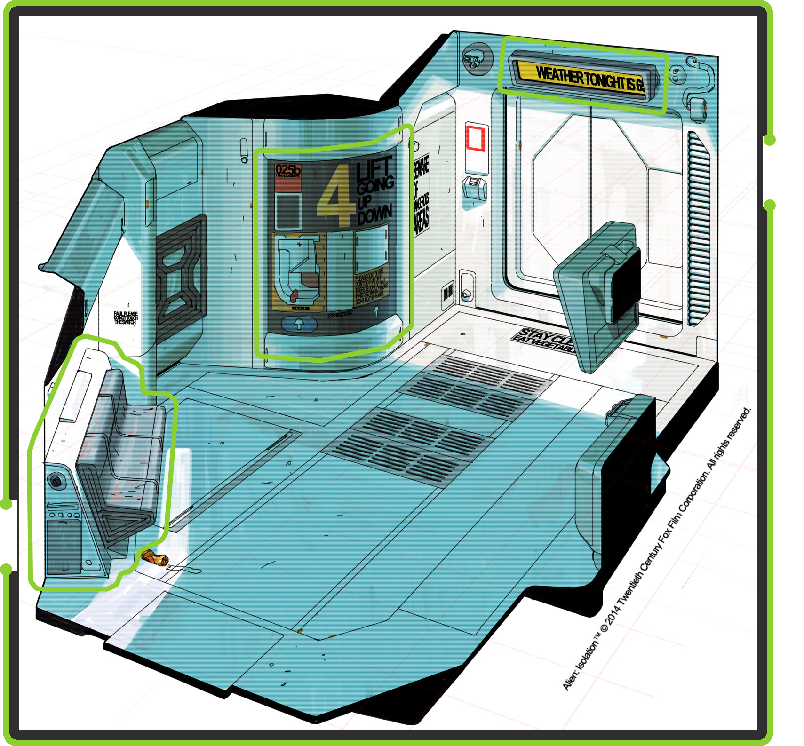
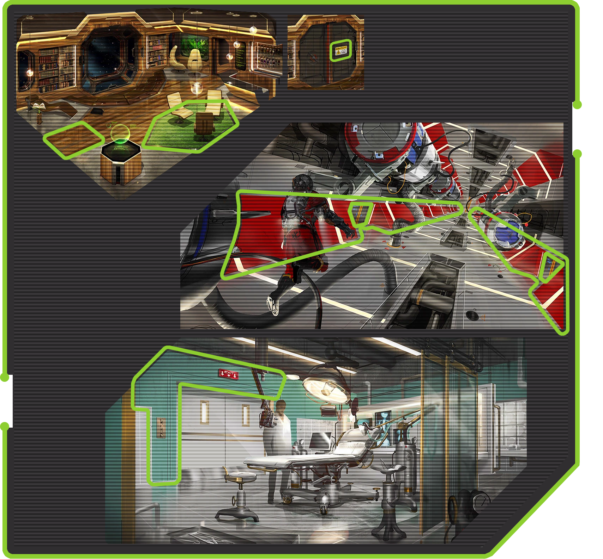
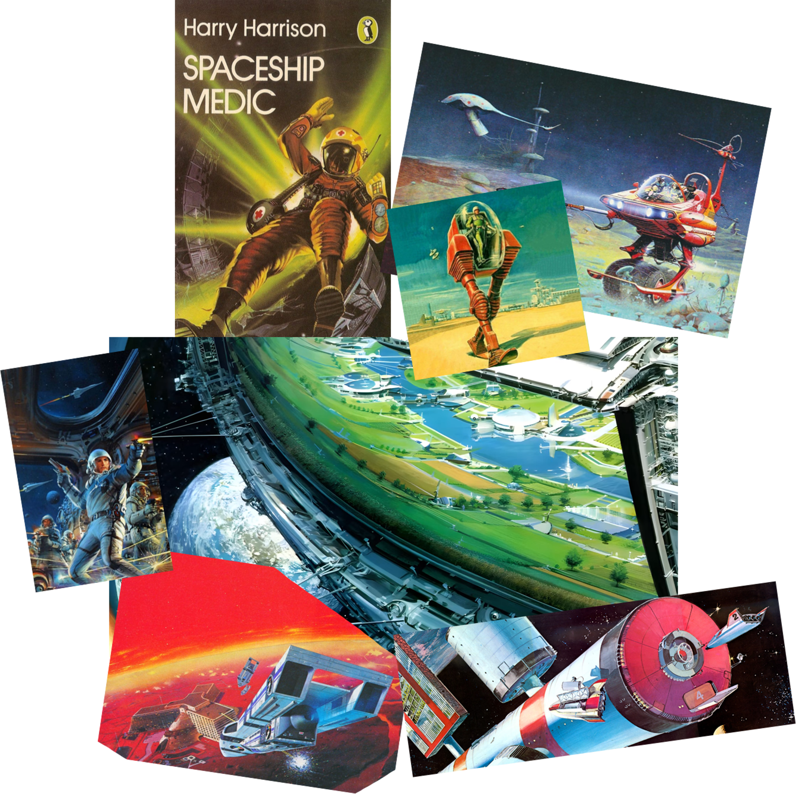

# 
 <ins>Table of contents</ins>

<!-- TOC -->
* [
 <ins>Table of contents</ins>
](#div-aligncenter-instable-of-contentsinsdiv)
* [
 Foreword
](#div-aligncenter-foreworddiv)
* [
 Setting Overview
](#div-aligncenter-setting-overviewdiv)
* [
 Visual Inspirations
](#div-aligncenter-visual-inspirationsdiv)
    * [
 Alien 1979 & Alien: Isolation
](#div-aligncenter-alien-1979--alien-isolationdiv)
    * [
 Prey (2017)
](#div-aligncenter-prey-2017div)
    * [
 Retrofuturism illustrations (Moebius, Tim White, John Berkey & Many, Many More)
](#div-aligncenter-retrofuturism-illustrations-moebius-tim-white-john-berkey--many-many-morediv)
    * [
 Further Material
](#div-aligncenter-further-materialdiv)
<!-- TOC -->
# 
 Foreword

This is intended to be an ever-expanding document that will most certainly be subject to additions
and removal as the server's style and themes mature.

It details what's expected out of sprite contributions for FunkyStation.\
This **isn't** a spriting guide; this document expects you to know how to make sprites and have a
localhost set up. If you don't, then check out the Guidelines & Resources forum in the
*resprite-workgroup* on the Discord for an ever-expanding list of resources,
from beginner contributor guides to pixel art guides as well as [Funky's own development wiki](https://docs.funkystation.org/)

To discuss this document or Funky's art in general you can contact Tea(d.d.tea on Discord!). This
anything you are unsure about, make you uncomfortable, wish to add, remove, etc etc.

# 
 Setting Overview

NanoTrasen is a megacorporation like no other, so much so that the word "megacorporation" does not do it
justice, and is ever-expanding with its reign only challenged by the Syndicate.

The Syndicate is a cooperative effort of several different smaller corporations - chief amongst them
the Gorlex Marauders, Interdyne, Cybersun and Donk Co. - to fight NanoTrasen's growing power and influence.
They achieve this through subterfuge, sabotage and sometimes outright war.

Each round takes place aboard one of NanoTrasen's many research-colonial outposts across the outskirts of their
influence, where players navigate Funky's corporate dystopia filled with corruption, brutality and
conflict.

At its core, NanoTrasen is a false utopia. It hides this corporate brutalism, class-based oppression
and disregard for the life of those under its service with decadent luxury and bright, optimistic
colours.

 Poster from: Alien: Isolation (2014)
# 
 Visual Inspirations

Naturally, we draw inspiration from a lot of retrofuturistic media, where corporate dystopian worlds are
oftentimes explored. Some examples include:

## 
 Alien 1979 & Alien: Isolation

Alien's architecture is incredible inspiration. Its environment, for example concept art from [Edouard Caplain](https://www.artstation.com/edouardcaplain)
exemplifies retrofuturism perfectly: white/beige sterile colours, contrasted by bright streaks of colour and signage.

Funky incorporates more colour and luxury into the designs, but there are some quintessentially retrofuturistic design
elements that are prevalent in much of the game's concept art and environment renders.
- Sleek lines & shapes
- Beige/whites (sterile colours)
- High-contrast colours that lead the eye to somewhere
- Warning & general signage
- Occasional ventilation/grilles.

Check out [The Art Of Alien Isolation](https://archive.org/details/the-art-of-alien-isolation) for more, or look at the
artists who worked on the game like [Edouard Caplain](https://www.artstation.com/edouardcaplain)
as well as the movie sets and concept art.

## 
 Prey (2017)

There isn't much of relevance in Prey's costume design, but there is a lot to take inspiration from in its environment
design and colour use.\
While Prey is a touch too modern, featuring futuristic *Neo Art Deco* designs and furniture, its generous use of
bright colours, wood (in our case probably fake/synthetic) and luxurious office designs are worth taking note of.

Most importantly, it tries to simulate natural environments with plants, fake grass, wood, etc. Unlike the *Alien*
franchise, we are trying to hide the depressing reality of living aboard a corporate ship in space through
simulative and luxurious designs.

- Luxury offices featuring many "natural" elements
- Warning & general signage
- High-contrast colours
- Colours with purpose (showing the wings/departments of the station)

Check out [The Art of Prey](https://drive.google.com/file/d/1uUUszH19hXNiEabQZci1q3fu_-dvUTlP/view) for more, or
look at artists who worked on the game like [Fred Augis](https://drive.google.com/file/d/1uUUszH19hXNiEabQZci1q3fu_-dvUTlP/view)

## 
 Retrofuturism illustrations (Moebius, Tim White, John Berkey & Many, Many More)

This is the founding father of Funky's aesthetic, so to speak.There is so much retrofuturistic art to take inspiration from - Moebius, John Berkey, Tim White, Syd Mead and many more. Funky's dominant cultural inspirations are America,
China and Soviet Russia, with our canonical language being Anglo-Mandarin.

## 
 Further Material

This is a (relatively) small sample size of materials and references, so definitely do your own research.\
I'm going to list some websites that I found to be of use, feel free to send me more so I can expand this list.

This is not an automatic endorsement of everything listed here, use this material always within the context of Funky.

- _[Tv Tropes - Cassette Futurism](https://tvtropes.org/pmwiki/pmwiki.php/Main/CassetteFuturism)_
- _[Aesthetics Wiki - Cassette Futurism](https://aesthetics.fandom.com/wiki/Cassette_Futurism)_
- _[r/cassettefuturism(ahh, reddit!!)](https://www.reddit.com/r/cassettefuturism/)_
- _[70s Sci-Fi Art](https://70s-sci-fi-art.ghost.io/)_
- _[Alien: Isolation poster gallery](https://postimg.cc/gallery/hD93K5d)_
